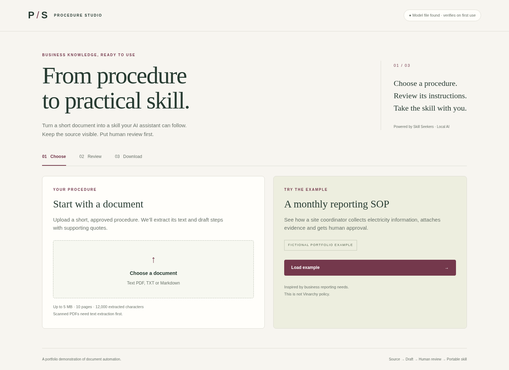

# Interview portfolio projects

Two independent prototypes with business context, source evidence and honest evaluation:

- **[Membership Opportunity Lab](docs/sweatpals/README.md)** — helps a fictional fitness host identify repeat attendees to invite into a paid membership. Transparent eligibility rules, keyword versus MiniLM/FAISS comparison, and local Qwen invitation drafts. Built as a proposed component for Sweatpals' host workflow; no affiliation or customer data.
- **Procedure-to-Skill Studio** — document-to-skill drafting and human review, described below.

Run both in one process with `bash scripts/start_membership.sh`. The membership interface is at `/membership/`; the existing procedure interface remains at `/`.

# Procedure-to-Skill Studio

A small business document tool built on **Skill Seekers**. Load a procedure, draft instructions with a local Hugging Face model, review the source and download a portable AI skill.

**[Try the public demo](https://effective-space-winner-9g7q6g66v6jh7569-8000.app.github.dev/)** · **[Read the real-document evaluation](docs/evaluation/real-document-review.md)**

Visitors do not need a GitHub login. GitHub may show a development-port notice; choose **Continue** to open the demo. Load the fictional example, choose **Sample preview** to try the review/export flow without inference, or **Generate** for local Qwen drafting. Review both the instructions and source before approving a download.

The demo uses a GitHub Codespace and is available while that Codespace and its server are running. It may sleep or be unavailable; the repository and screenshot remain available. Use public or fictional inputs. This is a portfolio prototype for drafting and review; it does not certify procedural accuracy.

This is an interview portfolio project in the Projects collection. Its fictional electricity-reporting example illustrates a reporting workflow; it is **not Vinarchy policy**. Vinarchy's [public sustainability page](https://vinarchy.com/pages/sustainability) describes collecting and auditing emissions data after its merger. That is business context, not evidence of an internal system problem or endorsement.



## What you can demonstrate

1. Load the fictional example or upload a short text PDF, TXT or Markdown procedure.
2. Generate a draft with Qwen2.5-1.5B-Instruct on CPU. Numbered procedures keep their detected source instructions and order; the model clarifies each instruction separately.
3. Inspect instructions beside their exact source quotes. Add missing instructions or correct wording. Unsupported quotes block approval.
4. Acknowledge review, then download `SKILL.md`, source references, review metadata and a structural quality report.

The model can omit details or misinterpret meaning. The exported package retains extracted source text in its references and selected source passages alongside clarifications. Exact quotation is a provenance check, not proof of semantic correctness or complete coverage. The process owner reviews both. Editing resets approval.

The **sample preview** demonstrates the same review/export flow without a downloaded model. It is explicitly labelled and uses fixed fictional content. Uploaded documents never silently use the preview.

## Run entirely in GitHub Codespaces

To run your own copy from this repository:

1. Open the repository on **main**, select **Code → Codespaces → Create codespace**. Use a machine with at least 4 GB RAM; 4 CPU cores will help drafting speed.
2. Wait for the devcontainer setup to install the pinned dependencies. The sample preview does not need an API key or model download.
3. For live local drafting, run:

   ```bash
   .venv/bin/python scripts/download_model.py
   ```

   This downloads approximately 1.12 GB from Hugging Face and verifies its pinned size and SHA-256. Model weights are ignored by Git.

4. Start the application:

   ```bash
   .venv/bin/python -m uvicorn studio.app:app --host 0.0.0.0 --port 8000
   ```

5. Open port **8000** from the Codespaces Ports panel. Keep **private** visibility for your own use. To share a public demonstration, right-click the port and select **Port Visibility → Public**, then copy the forwarded address. The UI runs in your browser; Python and the model run on the Codespaces cloud computer.

Codespaces can stop when inactive and has account-specific quotas and charges. It is a development/demo runtime. GitHub Pages does not execute this Python backend. The owner has run this project in Codespaces; see [verification](docs/verification.md) for tested behavior and limits.

## Run in another Linux cloud environment

Python 3.12, GCC/G++, sufficient disk space and at least 4 GB RAM are recommended. No GPU is required.

```bash
bash scripts/setup.sh
.venv/bin/python scripts/download_model.py  # optional for sample preview
.venv/bin/python -m uvicorn studio.app:app --host 0.0.0.0 --port 8000
```

The setup script builds the CPU inference library. Local inference has no provider token charges, but cloud compute/storage and model downloads still have costs. Source content is not sent to a model provider.

## What Skill Seekers does here

| Reused component | Role |
|---|---|
| `PDFExtractor` | Extract source page text and preserve page numbers |
| `WorkflowEngine` | Run the custom business-SOP enhancement stage with explicit source context |
| `SkillQualityChecker` | Report generic structure/link/format checks |
| Claude packaging adaptor | Create the portable ZIP with skill, references and assets |

Our application adds bounded browser uploads, a CPU generation transport, source mappings, editable human review and server-enforced export approval. Upstream source is unmodified. Its general quality score does not certify business accuracy. We use clean PDF page text rather than its programming-code heuristics.

No embeddings, vector database or Microsoft account are required for this first version. It does not include a tested Microsoft 365 integration; GitHub Copilot skill support and Microsoft 365 tenant integration are separate capabilities.

## Practical limits

- English text procedures: at most 5 MB, 10 PDF pages and 12,000 extracted characters.
- Best results with short numbered instructions; at most 16 detected numbered steps. Long instructions need splitting. Freeform documents require especially careful coverage review.
- Numbered drafting can omit applicability, prerequisites, tables and continuations across pages from the main skill. The reference file preserves extracted text, but table layout is flattened. Check the original document before operational use; see the [real-document evaluation](docs/evaluation/real-document-review.md).
- No OCR, emissions calculation, evidence-content auditing or automatic external submission.
- Single-user demo: sessions expire after one hour and are lost on restart. At most 32 active sessions. Export files are temporary and removed after download.
- Use fictional/public demonstration data. This app has no organisational authentication, authorisation or confidential-data deployment controls.
- Human review acknowledgement records a demo action; it does not verify the reviewer's identity or approval authority.

## Checks

```bash
.venv/bin/python -m pytest -q
node --check studio/static/app.js
```

Tests cover real PDF extraction and ZIP outputs, workflow wiring, citation errors, review enforcement, edit reset, model-unavailable handling and verified-download cleanup. Unit/API tests use a deterministic generation transport; **they do not measure model accuracy**. Real model evaluation is recorded separately in [verification](docs/verification.md). GitHub Actions runs the core suite without downloading model weights.

## Interview explanation

“I adapted an existing document-to-skill engine for a business owner. I tested a small local model, found omissions and citation errors, and designed source preservation and human approval around those limits. The same engine could support other reviewed procedures, while organisational integration and quality evaluation would come next.”

The next steps are stronger coverage evaluation, authenticated organisation access and a tested Power Automate/API adapter. Those are future work, not current capabilities.

## Licence

This repository retains its existing GPL-3.0 licence. Dependencies and model weights retain their own licences; see [third-party notices](THIRD_PARTY_NOTICES.md). No uploaded documents or model weights are included in the repository.
