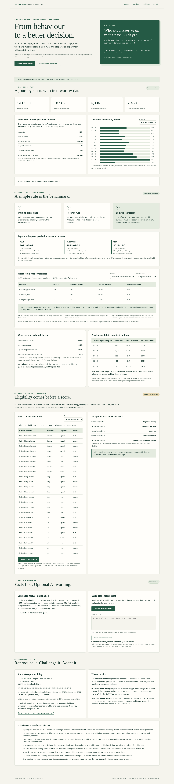

# Audience Engagement & Experiment Lab

A reproducible customer-engagement prototype for an interview portfolio: audit real journeys, compare a small predictive model with simple baselines, and prepare a fictional experiment with consent controls. Methods map to fan analytics and OTT analytics workflows. This uses public gift-retail data, not EXL or Sky customers, viewing behaviour or subscription churn.

[Static dashboard](https://danielbala-code.github.io/Projects/) · [Source code](https://github.com/Danielbala-code/Projects/tree/main/audience) · [Live Codespace](https://effective-space-winner-9g7q6g66v6jh7569-8000.app.github.dev/audience/)

The static dashboard runs in the browser using a committed aggregate snapshot. It remains usable when Codespaces stops. The live interface adds Python APIs and new Qwen explanations; the owner's Codespace must be running and updated. GitHub may show a development-port notice. Neither interface sends campaigns.



## The five-step explanation

1. **Establish data quality.** An invoice can contain many item rows. Count distinct cleaned invoices as purchases; show missing IDs, cancellations, exact duplicate rows, nonpositive amounts and conflicting invoice records.
2. **Define the question before modelling.** Among known customers with a positive purchase in the preceding 90 days, predict any positive purchase invoice in the next 30 days. Compute all features strictly before the prediction date. This is repeat-purchase propensity, not churn or incremental campaign response.
3. **Make the model earn inclusion.** Compare July training prevalence, a recent-purchase-first rule and fixed L2 logistic regression on identical September and November cohorts. Display measured results and probability calibration rather than assume AI helps.
4. **Separate permission from prediction.** Use a completely separate fictional fixture to block wrong organisation, opt-outs, unknown consent, recent contacts and duplicate identities. Allocate eligible cases to disjoint test/control groups within territory and segment. No real customer is treated as contactable.
5. **Explain measured facts.** Python/SQL calculate the report. Qwen can phrase a referenced explanation for human review. The factual explanation remains usable if inference fails or weights are missing.

## Real-data provenance and cleaning

[UCI Online Retail](https://archive.ics.uci.edu/dataset/352/online+retail), Daqing Chen, DOI [10.24432/C5BW33](https://doi.org/10.24432/C5BW33), [CC BY 4.0](https://creativecommons.org/licenses/by/4.0/). Official CSV: `https://archive.ics.uci.edu/static/public/352/data.csv`.

The downloaded artifact is 45,038,760 bytes, SHA-256 `a2f79bbdd4463df6db8a3f5a50b9c980ae8f645a370bf5e2c0d6097f9e817b05`. This checksum was recorded from the official HTTPS download, then pinned and verified for subsequent builds; it is not a publisher-signed checksum.

Source: 541,909 lines from December 2010 through 9 December 2011. The shop is UK-based and sells gifts, with many wholesale customers. The public metadata says no missing values, but the actual customer IDs have missing entries; the pipeline audits observations rather than trusting that label.

First matching exclusion reason:

| Result | Lines |
|---|---:|
| Cancellation invoice | 9,251 |
| Exact source-row duplicate | 5,268 |
| Missing customer | 134,658 |
| Nonpositive quantity or price | 40 |
| Conflicting invoice identity/date/country | 1,586, across 30 invoices |
| Retained positive item lines | 391,106 |

Result: **18,502 invoices, 4,336 known customers**. Exact duplicate removal may discard legitimate identical item lines; this is a visible assumption. Returns and cancellation lines are excluded, so monetary features represent positive purchases, not net revenue. No artificial outlier trimming or class rebalancing is applied. Missing identity rows do not become guessed customers. Customer country is the most recent pre-cutoff recorded invoice country.

The originally proposed MIND news dataset was not used: its current Hugging Face download returned 401 requiring access, and its old Microsoft Azure release returned 409. UCI was the real-data alternative in the design; the domain change is explicit. The prior football workbook remains a separate project context and is not joined to these customers.

## Fixed model design and actual results

Snapshots use one row per customer at each prediction date. July, September and November have complete future windows in the source. A customer may appear in multiple cohorts, as is normal when scoring an existing customer base; this is not an unseen-customer benchmark. The model never receives customer ID or future features.

| Cohort | Prediction date | Customers | Repeat purchasers |
|---|---|---:|---:|
| Train | 1 July 2011 | 1,968 | 617 |
| Validation | 1 September 2011 | 1,920 | 726 |
| Reserved test | 1 November 2011 | 2,459 | 1,055 |

`StandardScaler` fits training data only. Logistic regression uses C=1, L2 regularisation, lbfgs, max_iter=500, seed=17. Inputs: days since last purchase; log(1 + invoice count); log(1 + positive purchase value); days since first purchase **within the 90-day window**. Observed tenure is not lifetime customer age. Features, dates, C and the 20% reporting cutoff were fixed before seeing evaluation results; no model search or threshold tuning was performed.

| November holdout | ROC-AUC | Average precision | Precision in top fifth |
|---|---:|---:|---:|
| Training prevalence | 0.500 | 0.429 | 44.5% |
| Recency rule | 0.553 | 0.469 | 50.2% |
| Logistic regression | **0.693** | **0.666** | **72.6%** |

All three compare the same 2,459 customers; the top fifth is 492 customers. Constant scores break ties by private customer ID, so that baseline's top-fifth result is arbitrary and does not show useful ranking. November repeat rate is 42.9%, versus July's 31.4%; seasonal change affects probabilities. Brier error: prevalence 0.258, logistic 0.228. Cohort-wide probability bins and UK/other-country, one/multiple-purchase ranking slices appear in the dashboard; slice selection does not silently change calibration's denominator.

The paired customer-bootstrap 95% interval for November logistic-versus-recency AUC gain is **0.113–0.166** (300 fixed-seed resamples). It estimates sampling uncertainty within this cohort, not training uncertainty, seasonal robustness or causal uplift. A single-class slice reports undefined AUC and suppresses AP instead of presenting a misleading comparison.

No embedding model or retrieval system is needed for four numeric predictors. The existing MiniLM belongs to the separate membership project. Qwen2.5-1.5B-Instruct Q4_K_M is a pretrained local language model, not the predictive model. It is not fine-tuned here, and no paid inference API is required.

## Reproduce or run

Python 3.12. Use the existing cloud checkout; a second worktree is unnecessary for setup.

```bash
# Existing Codespace: stop your current server with Ctrl+C, then:
git pull --ff-only origin main
bash scripts/start_audience.sh
```

Open port 8000, then `/audience/`. This helper installs the small modelling/membership dependencies and serves all three apps. It uses the committed aggregate report, so a new source or model download is not required just to explore it. A fresh environment first runs the existing `scripts/setup.sh` to install the base application.

Recompute the measured report from the official source:

```bash
.venv/bin/python -m scripts.download_audience
.venv/bin/python -m scripts.build_audience
```

Download Qwen only if you want new AI explanations:

```bash
.venv/bin/python scripts/download_model.py
```

The raw source and private SQLite database are ignored under `.runtime/audience/`; model weights are ignored under `.models/`. Public `docs/audience/results.json` contains only aggregates, model measurements, coefficients, fact statements and explicitly fictional campaign cases. Builds replace the snapshot atomically only after source verification and successful analysis. No real customer IDs or individual probabilities are published.

API paths under `/audience`: `GET /api/report`, `GET /api/campaign.csv` (all eligible fictional cases), `POST /api/brief`. The browser's fictional CSV respects the selected territory; the API export is the whole fixture. Missing reports/weights return 503, concurrent audience generation 409, and invalid/generated brief failures 502. No fallback is labelled as inference. Reference/numeric checks are narrow; a person must verify meaning and causal wording. Editing a draft resets review acknowledgement.

Static preview: serve the `docs` directory with a static HTTP server. No calls to the live backend are required for filters, results or fictional CSV. GitHub Pages uses `main` and `/docs`; Pages does not run Python or Qwen.

## Practical integration boundary

For EXL-style fan reporting, replace invoice SQL with approved fan/event tables, preserve denominators, segment definitions, exception reporting and experiment assignment. For Sky-style OTT analysis, define viewing/retention/subscription outcomes and observation windows with domain experts; purchases cannot validate those outcomes. A warehouse adapter can materialise the same aggregate JSON contract from approved Databricks, Snowflake or AWS tables. None of those connections was implemented or exercised here.

Production work: authenticated tenant access, consent/deletion governance, event reconciliation, persisted randomized assignments, model calibration/drift monitoring, domain-specific evaluation and a controlled test of incremental benefit. This prototype demonstrates the workflow and its checks; it does not certify production security, customer eligibility or business lift.

[Detailed verification evidence](verification.md). The static dashboard includes the original local Qwen draft and an author-reviewed example, clearly labelled as saved output.
