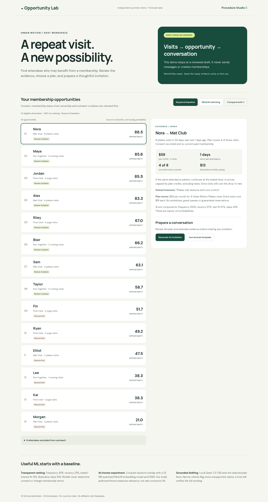

# Membership Opportunity Lab

A host-facing portfolio prototype: identify repeat attendees who may benefit from a paid membership, explain the suggested plan, and draft an invitation for human review.

**Independent project inspired by public Sweatpals host workflows. No affiliation, customer data or internal-system access.**



## Try it

Run both portfolio apps in one cloud process:

```bash
bash scripts/start_membership.sh
```

Open forwarded port **8000**, then append **`/membership/`** to its address. The original Procedure Studio remains at `/`. Python and both models run in the cloud machine; the browser displays the interface. No model API key or Microsoft account is required.

For the owner's existing public Codespace, first stop the old server with **Ctrl+C**, then run:

```bash
git pull --ff-only origin main
bash scripts/start_membership.sh
```

The helper installs the additional pinned packages, downloads/verifies MiniLM and verifies/reuses Qwen before starting the server. A fresh environment also installs the original app dependencies; building the CPU inference library can take several minutes.

The owner's forwarded address is `https://effective-space-winner-9g7q6g66v6jh7569-8000.app.github.dev/membership/`. It serves this new interface **after that Codespace is updated and restarted**, and only while the Codespace is running. GitHub may display its development-port notice. Public port visitors do not need a GitHub account. GitHub Pages alone cannot run this backend.

## A two-minute walkthrough

1. Review the 14 eligible attendees and expand the 8 exclusions. Existing members, wrong-host records, opt-outs, unknown consent/status and recent outreach cannot receive drafts.
2. Select Nora: eight Pilates visits do **not** mean eight membership credits. Her fictional plan covers four; the saving illustration caps at those credits.
3. Compare keyword matching with MiniLM. Both modes retain the same structured eligibility rules and price terms.
4. Generate a local AI invitation, or explicitly choose the factual template. Verify every benefit and amount, edit the wording and acknowledge review before downloading the local JSON draft. Editing resets review.

Nothing is sent, booked or subscribed. Lower-frequency attendees are marked “Nurture first”; being ranked is not a recommendation to contact everybody.

## Where it fits in Sweatpals

Public guides already describe memberships, attendance-based campaign audiences, host analytics and membership-status tracking. The proposed contribution is an **evaluated recommendation component** between those existing surfaces:


Today the app uses a fixed fictional JSON snapshot. A production adapter would need an approved data contract for attendance, member status, plan entitlements and outreach permissions, tenant-scoped access controls, campaign integration and outcome tracking. Public pages do not establish an available Sweatpals API. See [business-fit research](business-fit.md) for sources and [evaluation](evaluation.md) for evidence and limits.

## Model choices and cost

| Component | Choice | Reason |
|---|---|---|
| Eligibility / pricing | Deterministic Python | Membership status, consent and plan entitlements need exact rules |
| Default ranking | Frequency + recency + keyword relevance + conditional value | Transparent, fast, and useful without embeddings |
| Text matching comparison | Quantized all-MiniLM-L6-v2 ONNX + normalized FAISS inner product | About 23 MB model; local CPU semantic relevance, without PyTorch |
| Invitation drafting | Qwen2.5-1.5B-Instruct Q4_K_M via llama.cpp | Reuses the existing 1.12 GB local model and one shared instance |
| Offline evaluation | Authored synthetic relevance grades and expected plans | Demonstrates mechanics; does not estimate real conversion |

Embeddings match interest text to three plan-benefit descriptions. They are not an LLM document-retrieval system or a conversion predictor. FAISS demonstrates a catalogue-search interface; three plans do not need a vector database. Structured plan facts, not nearest-neighbour text, govern prices and entitlements.

No provider token charges apply to local inference. Cloud CPU, storage, uptime and downloads still cost resources. API responses report latency; generation consumes tokens locally. All model artifacts are pinned and checksum-verified, downloaded from Hugging Face and excluded from Git. A 4 GB machine is the minimum recommendation; the two apps share Qwen to avoid duplicate allocations.

## What the experiment found

On the reserved synthetic split, both modes scored **precision@5 0.80**, **NDCG@5 1.00**, and **5/5 expected-plan matches**. Measured first-run ranking took **0.76 ms for keywords** and **358.17 ms for MiniLM including initialization** on this environment.

**No measured relevance improvement from embeddings on this fixture.** Keep the keyword baseline as the default. Validate semantic matching against broader independently labelled examples before paying its added cost. These small, easy examples and author-created labels cannot establish signup lift or production accuracy.

The initial three real Qwen trials yielded two accepted drafts and one rejected draft. Exact wording still needs human review even when the narrow checks pass. The formerly rejected Jordan draft passed after the false-positive correction; the [AI interface screenshot](../assets/membership-ai-draft.png) shows the actual output. See the evaluation record for the failure and subsequent changes.

## Developer checks

```bash
.venv/bin/python -m pytest -q
node --check membership/static/app.js
.venv/bin/python -m pip check
```

Tests can run without downloaded model weights; actual CPU embedding/generation runs are recorded separately. The public app is a single-process demo using only fictional data, with no organisational authentication or durable review store. It is not a production integration.

[Application note](application-note.md) · [Build decisions and review](build-decisions.md) · [Third-party notices](../../THIRD_PARTY_NOTICES.md)
